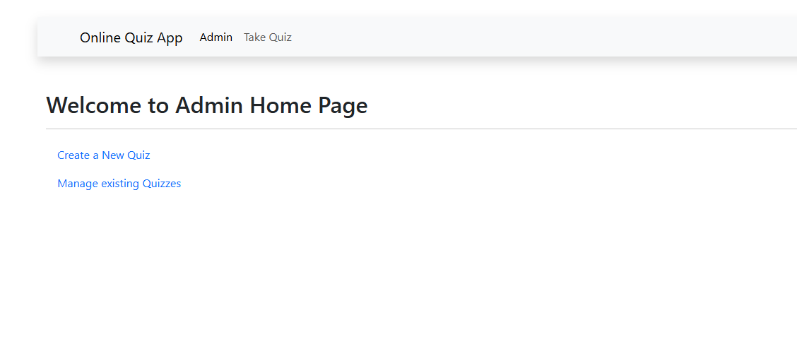
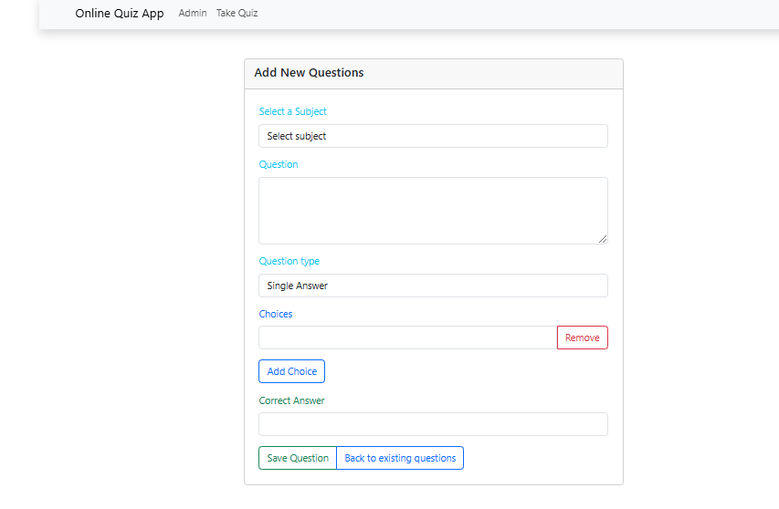
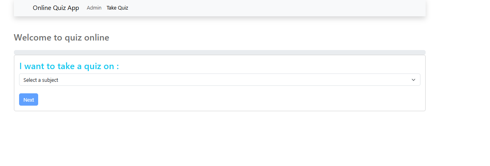
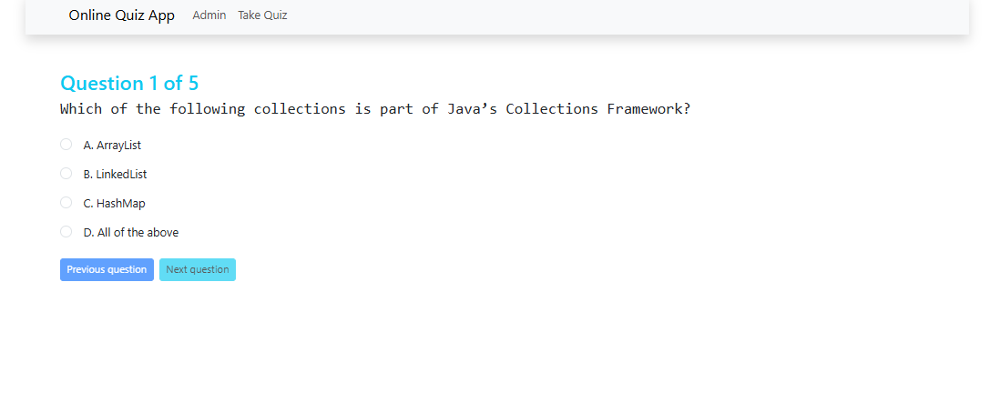
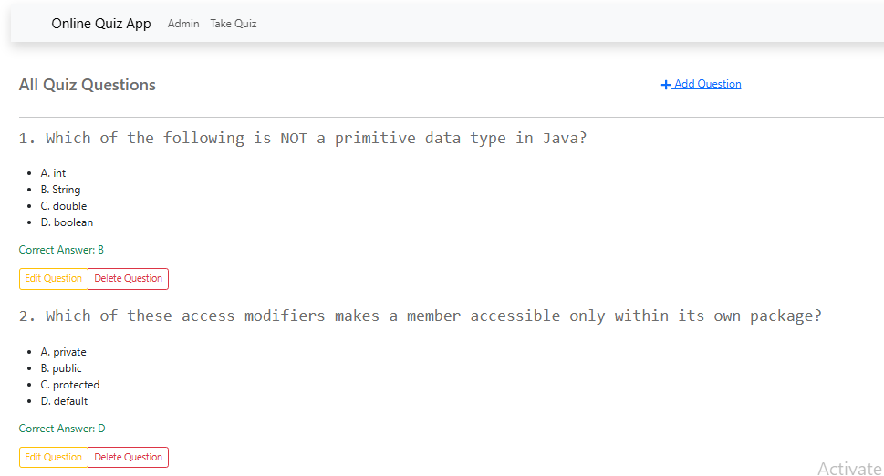

# Online Quiz Application

## Project Overview

The **Online Quiz Application** allows users to take quizzes on various topics, providing a dynamic and interactive learning experience. Built using **Java**, **JavaScript**, **ReactJS**, **Spring Boot**, and a **MySQL** database, this application supports the creation of multiple-choice quizzes and tracks users' progress. It offers a smooth and intuitive interface for both quiz takers and administrators.

## Features

- **Quiz Management**:
  - Administrators can create, edit, and delete quizzes.
  - Each quiz consists of multiple-choice questions, with options and a correct answer(s).
  
- **Quiz Taking**:
  - Users can select and take quizzes from various topics.
  - One question is displayed at a time with multiple-choice options.
  - Immediate feedback is provided after submitting answers (correct/incorrect).

- **Scoring & Progress Tracking**:
  - The application calculates and displays the user's score at the end of each quiz.
  - Users can track their quiz attempts and scores.
  - Past quiz attempts and scores are available for review.

- **User Interface**:
  - A clean, user-friendly interface designed with **ReactJS** for a smooth experience.
  - Consistent and intuitive layout for easy navigation.

- **Data Persistence**:
  - A **MySQL** database is used to store quizzes, user accounts, and quiz results.
  - The application implements CRUD operations for managing data via Spring Boot.

## Technologies Used

- **Frontend**: 
  - **ReactJS**, **JavaScript**
  
- **Backend**: 
  - **Spring Boot** (Java)
  
- **Database**:
  - **MySQL**

- **Build Tools**:
  - **Vite**

## Installation

Follow these steps to set up the application on your local machine.

### Prerequisites

- **Java** (version 8 or higher)
- **MySQL** installed and running
- **Node.js** (for frontend)
- **Maven** (for backend)
- **Vite** (for building the React application)

### Steps

1. **Clone the repository**:
   - Open your terminal and clone the repository:
     ```
     git clone https://github.com/your-username/online-quiz-application.git
     cd online-quiz-application
     ```

2. **Backend Setup (Spring Boot)**:
   - Navigate to the backend directory.
   - Open the project in your IDE (e.g., IntelliJ IDEA, Eclipse).
   - Set up MySQL and create a database for the application.
   - Update `application.properties` with your database credentials.
   - Run the Spring Boot application:
     - You can run it through your IDE or use Maven to build and run the application.

3. **Frontend Setup (ReactJS)**:
   - Navigate to the frontend directory.
   - Install dependencies:
     ```
     npm install
     ```
   - Start the React development server:
     ```
     npm run dev
     ```
   - The frontend should now be running on `http://localhost:3000`.

4. **Access the Application**:
   - Open your browser and go to `http://localhost:8080` for the backend.
   - For the frontend, visit `http://localhost:3000`.

## Screenshots

Below are some screenshots of the application in action:

- 
- 
- 
- 
- 

(Replace the path with the actual location of the images you have uploaded)

## How to Use

1. **Admin Panel**: 
   - Log in with admin credentials to manage quizzes.
   - Create, edit, or delete quizzes and questions.
   
2. **User Panel**:
   - Browse available quizzes.
   - Start taking quizzes, answer questions, and receive immediate feedback.
   - View quiz results at the end of the quiz.


## License

This project is licensed under the MIT License - see the [LICENSE](LICENSE) file for details.

## Acknowledgments

- Thanks to [ReactJS](https://reactjs.org/), [Spring Boot](https://spring.io/projects/spring-boot), and [MySQL](https://www.mysql.com/) for providing excellent tools to develop this project.
